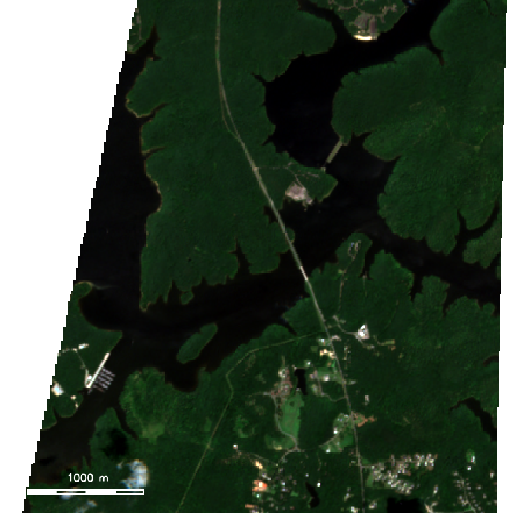
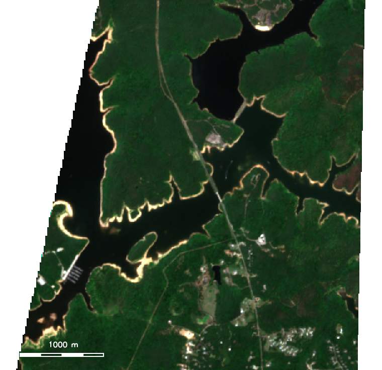

Satellite archives are full of before-and-after stories, but a static pair of
images rarely does them justice. A well-made animation does: it lets the eye
follow *where* and *how* the change happened. This post introduces
[**r.anim.morph**](https://github.com/OSGeo/grass-addons/tree/grass8/src/raster/r.anim/r.anim.morph),
a new [GRASS](https://grass.osgeo.org/) addon that builds smooth, spatially-aware
transitions between two rasters, and pairs it with
[**t.stac**](https://grass.osgeo.org/grass-stable/manuals/addons/t.stac.html) to
pull the imagery straight from a SpatioTemporal Asset Catalog.

Our subject is [Falls Lake](https://en.wikipedia.org/wiki/Falls_Lake), the
managed reservoir north of Raleigh, North Carolina. We will take a full year of
Sentinel-2 passes, from 25 July 2025 to today, find two cloud-free scenes that
bracket the window, and animate the reservoir's shoreline as it draws down over
the summer.

::: {#fig-hero}
```{=html}
<video autoplay loop muted playsinline width="620" style="max-width:100%"
       aria-label="Animation of Falls Lake shoreline receding between July 2025 and July 2026">
  <source src="images/falls_lake_anim_morph.mp4" type="video/mp4">
</video>
```

Falls Lake, upper Cheek Creek and Ledge Creek arms, morphing from 25 July 2025 to 3 July 2026. The animation is a single `r.anim.morph` contraction plan applied to Sentinel-2 true-color bands. As the water recedes, a bright fringe of exposed lakebed emerges along every cove. ([Download the MP4](images/falls_lake_anim_morph.mp4).)
:::

## Why animate at all?

The insight behind the Baia framework
([Lobo, Appert and Pietriga, 2019](https://doi.org/10.1109/TVCG.2018.2796557))
is that a convincing before-and-after animation requires **different pixels to
transition at different times**. A naive cross-dissolve fades the whole frame
uniformly and reads as a blur. To make a shrinking lake look like it is actually
shrinking, the pixels far from the final shoreline should disappear first and the
pixels near the final shoreline should disappear last. That ordering is what
r.anim.morph computes.

Given a *before* raster, an *after* raster, and a description of the change,
r.anim.morph produces an **animation plan**: two rasters, `S` and `E`, that store for
every pixel the normalized time its transition starts and ends. Each output
frame at time `t` is then a per-pixel blend:

$$
\alpha(i,j,t) = \mathrm{clamp}\!\left(\frac{t - S_{ij}}{E_{ij} - S_{ij}},\, 0,\, 1\right),
\qquad
\mathrm{frame}(i,j,t) = (1-\alpha)\,\mathrm{before}_{ij} + \alpha\,\mathrm{after}_{ij}
$$

r.anim.morph ships a family of **primitives** that generate the plan for you:
`blend`, `appearance`, `disappearance`, `contraction`, `expansion`,
`deformation`, `radial`, `directional`, and `dem`. A receding reservoir is the
textbook case for `contraction`.

::: {.callout-note}
## Tools used in this post
Both tools are GRASS addons installable with `g.extension`:

- [**t.stac**](https://grass.osgeo.org/grass-stable/manuals/addons/t.stac.html)
  searches and imports STAC assets (here, Sentinel-2 L2A from Earth Search).
- [**r.anim.morph**](https://github.com/OSGeo/grass-addons/tree/grass8/src/raster/r.anim/r.anim.morph)
  builds the animation plan and renders the frames.

Everything else (`r.mapcalc`, `r.import`, `g.region`, `d.rgb`) is core GRASS.
:::

## 1. Set up a project and install the addons

Falls Lake sits in North Carolina, so we work in the state plane projection
[EPSG:3358](https://epsg.io/3358) (NAD83 / North Carolina, meters). Create a
project, then install the two addons.

```bash
# One-time: create a project in NC State Plane meters
grass -c EPSG:3358 ~/grassdata/falls_lake

# Install the addons into this GRASS installation
g.extension extension=t.stac
g.extension extension=r.anim.morph
```

Set the computational region over the reservoir at Sentinel-2's native 10 m
resolution. These bounds are in EPSG:3358 and enclose the upper reach of the
lake; adjust them to your own area of interest.

```bash
g.region n=268570 s=238520 e=639300 w=627590 res=10 -p
```

## 2. Explore the catalog with t.stac

t.stac mirrors the STAC hierarchy: a **catalog** holds **collections**, and a
collection holds **items** (individual acquisitions). Start at the catalog and
drill down. We use the public
[Earth Search](https://element84.com/earth-search/) endpoint, which serves
Sentinel-2 L2A as cloud-optimized GeoTIFFs, no credentials required.

```bash
# List collections in the catalog
t.stac.catalog url="https://earth-search.aws.element84.com/v1/"

# Inspect the Sentinel-2 L2A collection (extent, assets, date range)
t.stac.collection \
    url="https://earth-search.aws.element84.com/v1/" \
    collection_id="sentinel-2-l2a"
```

Before importing anything, search the collection over our region and window and
keep only near-clear scenes. The `query` option accepts the STAC
[query extension](https://github.com/stac-api-extensions/query), so we filter on
`eo:cloud_cover`.

```bash
# How many low-cloud Sentinel-2 scenes intersect the region this year?
t.stac.item \
    url="https://earth-search.aws.element84.com/v1/" \
    collection_id="sentinel-2-l2a" \
    datetime="2025-07-25/2026-07-17" \
    query='{"eo:cloud_cover":{"lt":10}}'
```

Over the window that search returns dozens of candidate passes. For the
endpoints we pick two nearly cloud-free scenes from the **same Sentinel-2 tile
(17SPV)** so their pixels line up: `S2A_17SPV_20250725_0_L2A` (25 July 2025,
2.3% cloud) and `S2B_17SPV_20260703_0_L2A` (3 July 2026, 0.8% cloud, the last
clear pass before today).

## 3. Import the bands you need

Add the `-d` flag to download and import assets. We only need four 10 m bands:
green and near-infrared for water detection, plus red and blue to complete the
true-color composite. The `extent=region` and `resolution=value` options clip
and resample each asset to the current region as it lands, and `method=bilinear`
reprojects from Sentinel-2's UTM grid into our state plane project.

```bash
# Before: 25 July 2025
t.stac.item -d \
    url="https://earth-search.aws.element84.com/v1/" \
    collection_id="sentinel-2-l2a" \
    ids="S2A_17SPV_20250725_0_L2A" \
    asset_keys="green,nir,red,blue" \
    method=bilinear extent=region \
    resolution=value resolution_value=10 \
    memory=1000 nprocs=4

# After: 3 July 2026
t.stac.item -d \
    url="https://earth-search.aws.element84.com/v1/" \
    collection_id="sentinel-2-l2a" \
    ids="S2B_17SPV_20260703_0_L2A" \
    asset_keys="green,nir,red,blue" \
    method=bilinear extent=region \
    resolution=value resolution_value=10 \
    memory=1000 nprocs=4
```

t.stac names each imported raster `<collection>.<item_id>.<asset>`, for example
`sentinel-2-l2a.S2A_17SPV_20250725_0_L2A.green`. Those names are precise but
awkward in `r.mapcalc`, so rename them to something short:

```bash
for band in green nir red blue; do
    g.rename raster="sentinel-2-l2a.S2A_17SPV_20250725_0_L2A.${band},before_${band}"
    g.rename raster="sentinel-2-l2a.S2B_17SPV_20260703_0_L2A.${band},after_${band}"
done
```

::: {.callout-important}
## Match your footprints before you compare
Sentinel-2 tile 17SPV sits at the edge of two orbit swaths, so different dates
image different diagonal slices of the region. If you compare water area over
the full region, a change in *coverage* masquerades as a change in *water*.
Always restrict the comparison to the pixels both scenes actually observed:

```bash
# 1 where every band of both dates has valid data, null elsewhere
r.mapcalc expression="common = if(before_green>0 && before_nir>0 && \
    after_green>0 && after_nir>0, 1, null())"
```

Every measurement below is confined to this common footprint.
:::

## 4. Delineate water with NDWI

The Normalized Difference Water Index
([McFeeters, 1996](https://doi.org/10.1080/01431169608948714)) separates open
water from land using the green and near-infrared bands. Water is bright in
green and dark in NIR, so open water has a positive NDWI.

```bash
for T in before after; do
    r.mapcalc expression="ndwi_${T} = float(${T}_green - ${T}_nir) / \
        float(${T}_green + ${T}_nir)"
    r.mapcalc expression="water_${T} = if(!isnull(common) && \
        ndwi_${T} > 0.0, 1, 0)"
done
```

::: {.callout-tip}
## A note on the L2A offset
Processing baseline 04.00 shifted Sentinel-2 L2A reflectance by a `-0.1`
additive offset (a `-1000` shift in raw DN). Because NDWI is a normalized ratio,
computing it directly on the digital numbers lets the common scale factor cancel
and keeps the denominator non-negative, which avoids the singularities you hit
if you convert dark water to reflectance first. For land-cover mapping, apply
the scale and offset; for a water index, DN works cleanly.
:::

With the two masks in hand, the change is a single map algebra expression:
water present on both dates is **stable**, water that became land is
**receded**, and land that became water is **gained**.

```bash
r.mapcalc expression="change = if(water_before==1 && water_after==1, 1, \
    if(water_before==1 && water_after==0, 2, \
    if(water_before==0 && water_after==1, 3, null())))"
r.report map=change units=k,p
```

Over the animated arms, the numbers tell a clear story: **3.72 km² of water on
25 July 2025 fell to 3.37 km² by 3 July 2026**, a 9.4% loss. Of that, 0.39 km²
of former lake became exposed shoreline while only 0.04 km² was newly flooded.

{#fig-change fig-alt="Map of Falls Lake with a red fringe of exposed shoreline ringing the blue stable water" width="70%"}

The before-and-after true-color composites show the same thing directly: the
after image grows a bright tan rim of freshly exposed sediment around every
finger of the lake.

::: {layout-ncol=2}
{#fig-before fig-alt="True color Sentinel-2 image of Falls Lake at full pool"}

{#fig-after fig-alt="True color Sentinel-2 image of Falls Lake drawn down with exposed shoreline"}
:::

## 5. Build the animation with r.anim.morph

Now the payoff. We hand r.anim.morph the true-color bands for each date and the two
water masks, and ask for a `contraction` primitive. Because the animation runs
over the pixel values directly, first stretch each band to a 0 to 255 display
range with a common min and max, and clip it to the common footprint. The same
stretch is applied to both dates so their colors are comparable:

```bash
# 1-99 percentile stretch per band: red 157-2333, green 218-2236, blue 198-2064
stretch() {  # stretch <src> <lo> <hi> <dst>
    r.mapcalc expression="$4 = if(isnull(common), null(), \
        round(255.0 * (min(max($1, $2), $3) - $2) / ($3 - $2)))"
}
stretch before_red   157 2333 bef_red8
stretch before_green 218 2236 bef_green8
stretch before_blue  198 2064 bef_blue8
stretch after_red    157 2333 aft_red8
stretch after_green  218 2236 aft_green8
stretch after_blue   198 2064 aft_blue8
```

With `bef_red8`, `bef_green8`, `bef_blue8` and their `aft_` counterparts in
hand, build the animation:

```bash
r.anim.morph \
    before=bef_red8,bef_green8,bef_blue8 \
    after=aft_red8,aft_green8,aft_blue8 \
    output=fl \
    primitive=contraction \
    mask_before=water_before \
    mask_after=water_after \
    roi_start=0.0 roi_end=0.85 \
    bg_start=0.85 bg_end=1.0 \
    blend_duration=0.25 \
    frames=48 \
    output_plan=fl_plan
```

A few options are worth calling out:

- **`primitive=contraction`** reads both masks and orders the transition so the
  water farthest from the new shoreline recedes first. This is what makes the
  lake look like it is draining rather than dissolving.
- **Staging** (`roi_start`/`roi_end` versus `bg_start`/`bg_end`) lets the water
  animate over the first 85% of the timeline while the surrounding land settles
  at the very end, keeping attention on the shoreline.
- **`output_plan=fl_plan`** saves the computed `S` and `E` rasters so you can
  inspect or reuse the plan.

That saved plan is the clearest window into how the framework thinks. Mapping
`fl_plan_S`, the per-pixel start time, shows the spatial ordering the
`contraction` primitive built: the shoreline fringe (low start times) begins
transitioning immediately, while the stable core and the background hold until
later.

{#fig-plan fig-alt="Viridis-colored map of r.anim.morph start times over the lake, with a graded fringe along the shoreline" width="65%"}

r.anim.morph writes one raster per band per frame, named `fl_b1_01`, `fl_b2_01`,
`fl_b3_01`, and so on through frame 48. You can play them inside GRASS with
[g.gui.animation](https://grass.osgeo.org/grass-stable/manuals/g.gui.animation.html),
or compose the three bands of each frame into RGB and export a video.

## 6. Export to GIF and MP4

Render each frame's three bands to a true-color PNG, then let `ffmpeg` (or
ImageMagick `convert`) assemble them.

```bash
# Composite each frame to a PNG with the cairo driver
export GRASS_RENDER_IMMEDIATE=cairo GRASS_RENDER_FILE_READ=TRUE
export GRASS_RENDER_WIDTH=760 GRASS_RENDER_HEIGHT=736
for f in $(seq -w 1 48); do
    for b in 1 2 3; do r.colors map=fl_b${b}_${f} color=grey255; done
    export GRASS_RENDER_FILE="frame_${f}.png"
    d.erase
    d.rgb red=fl_b1_${f} green=fl_b2_${f} blue=fl_b3_${f}
done

# Assemble a looping MP4 and a high-quality GIF
ffmpeg -framerate 15 -i frame_%02d.png -c:v libx264 \
    -pix_fmt yuv420p -crf 20 falls_lake_anim_morph.mp4

ffmpeg -framerate 15 -i frame_%02d.png -vf \
    "scale=620:-1:flags=lanczos,palettegen" palette.png
ffmpeg -framerate 15 -i frame_%02d.png -i palette.png \
    -lavfi "scale=620:-1:flags=lanczos[x];[x][1:v]paletteuse" \
    falls_lake_anim_morph.gif
```

The result is the animation at the top of this post.

## What the animation is, and is not

Falls Lake is a
[US Army Corps of Engineers](https://www.saw.usace.army.mil/Locations/District-Lakes-and-Dams/Falls-Lake/)
flood-control reservoir, so it is held close to its normal pool most of the
year. Across the full window its surface stayed within roughly 10% of full;
what you see is a **modest seasonal drawdown**, not a drought emptying the lake.
The reason it still reads clearly is that the upper arms are shallow and shelve
gently, so a small drop in stage exposes a wide planimetric band of lakebed. The
honest headline is a 9.4% surface-area decline over the mapped arms, and r.anim.morph
turns that measured, spatially-coherent change into something you can actually
watch.

That is the real value of pairing the two tools. **t.stac** makes a year of
analysis-ready Sentinel-2 a couple of commands away, and **r.anim.morph** turns a pair
of dates into a spatially-honest animation whose motion encodes *where* the
change is, not just *that* there was change. Swap the primitive to `expansion`
for a flood, `dem` for snow accumulating down from the peaks, or `directional`
for a fire front, and the same workflow retells a very different story.

## Reproduce this {#reproduce}

- **r.anim.morph** manual and source:
  [OSGeo/grass-addons](https://github.com/OSGeo/grass-addons/tree/grass8/src/raster/r.anim/r.anim.morph)
- **t.stac** manual:
  [grass.osgeo.org](https://grass.osgeo.org/grass-stable/manuals/addons/t.stac.html)
- **GRASS** downloads and documentation: [grass.osgeo.org](https://grass.osgeo.org/)
- **Earth Search** STAC endpoint: [element84.com/earth-search](https://element84.com/earth-search/)

Sentinel-2 data are courtesy of the
[Copernicus programme](https://www.copernicus.eu/) (ESA), served as
cloud-optimized GeoTIFFs by [Element 84](https://element84.com/) on AWS.

---

*Built with [GRASS](https://grass.osgeo.org/), the free and open-source
geospatial processing engine, and published on
[OpenPlains Learning](https://learning.openplains.com).*
