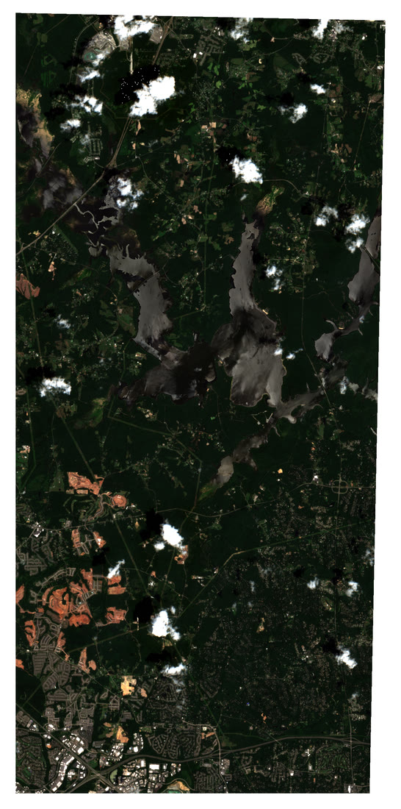

Satellite archives are full of before-and-after stories, but a static pair of
images rarely does them justice. A well-made animation does: it lets the eye
follow *where* and *how* the change happened. This post introduces
[**r.anim.morph**](https://github.com/OSGeo/grass-addons/tree/grass8/src/raster/r.anim/r.anim.morph),
a new [GRASS](https://grass.osgeo.org/) addon that builds smooth, spatially-aware
transitions between two rasters, and pairs it with
[**t.stac**](https://grass.osgeo.org/grass-stable/manuals/addons/t.stac.html) to
pull the imagery straight from a SpatioTemporal Asset Catalog.

Our subject is [Falls Lake](https://en.wikipedia.org/wiki/Falls_Lake), the
managed reservoir north of Raleigh, North Carolina. We will take a full year of
Sentinel-2 passes, from 25 July 2025 to today, find two cloud-free scenes that
bracket the window, and animate the reservoir's shoreline as the 2025 to 2026
drought draws it down.

::: {#fig-hero}
```{=html}
<video autoplay loop muted playsinline width="620" style="max-width:100%"
       aria-label="Animation of Falls Lake shoreline receding between July 2025 and July 2026">
  <source src="images/falls_lake_anim_morph.mp4" type="video/mp4">
</video>
```

Falls Lake, upper Cheek Creek and Ledge Creek arms, morphing from 25 July 2025 to 3 July 2026. The animation is a single `r.anim.morph` contraction plan applied to Sentinel-2 true-color bands. As the water recedes, a bright fringe of exposed lakebed emerges along every cove. ([Download the MP4](images/falls_lake_anim_morph.mp4).)
:::

## Why animate at all?

The insight behind the Baia framework
([Lobo, Appert and Pietriga, 2019](https://doi.org/10.1109/TVCG.2018.2796557))
is that a convincing before-and-after animation requires **different pixels to
transition at different times**. A naive cross-dissolve fades the whole frame
uniformly and reads as a blur. To make a shrinking lake look like it is actually
shrinking, the pixels far from the final shoreline should disappear first and the
pixels near the final shoreline should disappear last. That ordering is what
r.anim.morph computes.

Given a *before* raster, an *after* raster, and a description of the change,
r.anim.morph produces an **animation plan**: two rasters, `S` and `E`, that store for
every pixel the normalized time its transition starts and ends. Each output
frame at time `t` is then a per-pixel blend:

$$
\alpha(i,j,t) = \mathrm{clamp}\!\left(\frac{t - S_{ij}}{E_{ij} - S_{ij}},\, 0,\, 1\right),
\qquad
\mathrm{frame}(i,j,t) = (1-\alpha)\,\mathrm{before}_{ij} + \alpha\,\mathrm{after}_{ij}
$$

r.anim.morph ships a family of **primitives** that generate the plan for you:
`blend`, `appearance`, `disappearance`, `contraction`, `expansion`,
`deformation`, `radial`, `directional`, and `dem`. A receding reservoir is the
textbook case for `contraction`.

::: {.callout-note}
## Tools used in this post
Both tools are GRASS addons installable with `g.extension`:

- [**t.stac**](https://grass.osgeo.org/grass-stable/manuals/addons/t.stac.html)
  searches and imports STAC assets (here, Sentinel-2 L2A from Earth Search).
- [**r.anim.morph**](https://github.com/OSGeo/grass-addons/tree/grass8/src/raster/r.anim/r.anim.morph)
  builds the animation plan and renders the frames.

Everything else (`r.mapcalc`, `r.import`, `g.region`, `d.rgb`) is core GRASS.

Every step is shown twice: as terminal commands and as Python through the
[grass.tools](https://grass.osgeo.org/grass-stable/manuals/libpython/grass.tools.html)
API (GRASS 8.5 or newer). Pick a tab once and the whole post follows.
:::

## 1. Set up a project and install the addons

Falls Lake sits in North Carolina, so we work in the state plane projection
[EPSG:3358](https://epsg.io/3358) (NAD83 / North Carolina, meters). Create a
project, then install the two addons. In Python the project is opened once
with `grass.script.setup` and every later snippet reuses the same `tools`
object.

::: {.panel-tabset group="language"}

## Python

```python
import os

import grass.script as gs
from grass.tools import Tools

# One-time: create a project in NC State Plane meters
project = os.path.expanduser("~/grassdata/falls_lake")
gs.create_project(project, epsg="3358")

# Open the project; the session stays open for the rest of the post
session = gs.setup.init(project)
tools = Tools(session=session)

# Install the addons into this GRASS installation
tools.g_extension(extension="t.stac")
tools.g_extension(extension="r.anim.morph")
```

## Terminal

```bash
# One-time: create a project in NC State Plane meters
grass -c EPSG:3358 ~/grassdata/falls_lake

# Install the addons into this GRASS installation
g.extension extension=t.stac
g.extension extension=r.anim.morph
```

:::

Set the computational region over the reservoir at Sentinel-2's native 10 m
resolution. These bounds are in EPSG:3358 and enclose the upper reach of the
lake; adjust them to your own area of interest.

::: {.panel-tabset group="language"}

## Python

```python
tools.g_region(n=268570, s=238520, e=639300, w=627590, res=10, flags="p")
```

## Terminal

```bash
g.region n=268570 s=238520 e=639300 w=627590 res=10 -p
```

:::

## 2. Explore the catalog with t.stac

t.stac mirrors the STAC hierarchy: a **catalog** holds **collections**, and a
collection holds **items** (individual acquisitions). Start at the catalog and
drill down. We use the public
[Earth Search](https://element84.com/earth-search/) endpoint, which serves
Sentinel-2 L2A as cloud-optimized GeoTIFFs, no credentials required.

::: {.panel-tabset group="language"}

## Python

```python
url = "https://earth-search.aws.element84.com/v1/"

# List collections in the catalog
print(tools.t_stac_catalog(url=url).text)

# Inspect the Sentinel-2 L2A collection (extent, assets, date range)
print(tools.t_stac_collection(url=url, collection_id="sentinel-2-l2a").text)
```

## Terminal

```bash
# List collections in the catalog
t.stac.catalog url="https://earth-search.aws.element84.com/v1/"

# Inspect the Sentinel-2 L2A collection (extent, assets, date range)
t.stac.collection \
    url="https://earth-search.aws.element84.com/v1/" \
    collection_id="sentinel-2-l2a"
```

:::

Before importing anything, search the collection over our region and window and
keep only near-clear scenes. The `query` option accepts the STAC
[query extension](https://github.com/stac-api-extensions/query), so we filter on
`eo:cloud_cover`.

::: {.panel-tabset group="language"}

## Python

```python
import json

# How many low-cloud Sentinel-2 scenes intersect the region this year?
items = tools.t_stac_item(
    url=url,
    collection_id="sentinel-2-l2a",
    datetime="2025-07-25/2026-07-17",
    query=json.dumps({"eo:cloud_cover": {"lt": 10}}),
    format="json",
).json
for item in items:
    props = item["properties"]
    print(item["id"], props["datetime"][:10], props["eo:cloud_cover"])
```

## Terminal

```bash
# How many low-cloud Sentinel-2 scenes intersect the region this year?
t.stac.item \
    url="https://earth-search.aws.element84.com/v1/" \
    collection_id="sentinel-2-l2a" \
    datetime="2025-07-25/2026-07-17" \
    query='{"eo:cloud_cover":{"lt":10}}'
```

:::

Over the window that search returns dozens of candidate passes. For the
endpoints we pick two nearly cloud-free scenes from the **same Sentinel-2 tile
(17SPV)** so their pixels line up: `S2A_17SPV_20250725_0_L2A` (25 July 2025,
2.3% cloud) and `S2B_17SPV_20260703_0_L2A` (3 July 2026, 0.8% cloud, the last
clear pass before today).

## 3. Import the bands you need

Add the `-d` flag to download and import assets. We only need four 10 m bands:
green and near-infrared for water detection, plus red and blue to complete the
true-color composite. The `extent=region` and `resolution=value` options clip
and resample each asset to the current region as it lands, and `method=bilinear`
reprojects from Sentinel-2's UTM grid into our state plane project.

::: {.panel-tabset group="language"}

## Python

```python
# Before: 25 July 2025, after: 3 July 2026
for item_id in ("S2A_17SPV_20250725_0_L2A", "S2B_17SPV_20260703_0_L2A"):
    tools.t_stac_item(
        flags="d",
        url=url,
        collection_id="sentinel-2-l2a",
        ids=item_id,
        asset_keys="green,nir,red,blue",
        method="bilinear",
        extent="region",
        resolution="value",
        resolution_value=10,
        memory=1000,
        nprocs=4,
    )
```

## Terminal

```bash
# Before: 25 July 2025
t.stac.item -d \
    url="https://earth-search.aws.element84.com/v1/" \
    collection_id="sentinel-2-l2a" \
    ids="S2A_17SPV_20250725_0_L2A" \
    asset_keys="green,nir,red,blue" \
    method=bilinear extent=region \
    resolution=value resolution_value=10 \
    memory=1000 nprocs=4

# After: 3 July 2026
t.stac.item -d \
    url="https://earth-search.aws.element84.com/v1/" \
    collection_id="sentinel-2-l2a" \
    ids="S2B_17SPV_20260703_0_L2A" \
    asset_keys="green,nir,red,blue" \
    method=bilinear extent=region \
    resolution=value resolution_value=10 \
    memory=1000 nprocs=4
```

:::

t.stac names each imported raster `<collection>.<item_id>.<asset>`, for example
`sentinel-2-l2a.S2A_17SPV_20250725_0_L2A.green`. Those names are precise but
awkward in `r.mapcalc`, so rename them to something short:

::: {.panel-tabset group="language"}

## Python

```python
for band in ("green", "nir", "red", "blue"):
    tools.g_rename(
        raster=f"sentinel-2-l2a.S2A_17SPV_20250725_0_L2A.{band},before_{band}"
    )
    tools.g_rename(
        raster=f"sentinel-2-l2a.S2B_17SPV_20260703_0_L2A.{band},after_{band}"
    )
```

## Terminal

```bash
for band in green nir red blue; do
    g.rename raster="sentinel-2-l2a.S2A_17SPV_20250725_0_L2A.${band},before_${band}"
    g.rename raster="sentinel-2-l2a.S2B_17SPV_20260703_0_L2A.${band},after_${band}"
done
```

:::

::: {.callout-important}
## Match your footprints before you compare
Sentinel-2 tile 17SPV sits at the edge of two orbit swaths, so different dates
image different diagonal slices of the region. If you compare water area over
the full region, a change in *coverage* masquerades as a change in *water*.
Always restrict the comparison to the pixels both scenes actually observed:

::: {.panel-tabset group="language"}

## Python

```python
# 1 where every band of both dates has valid data, null elsewhere
tools.r_mapcalc(
    expression="common = if(before_green > 0 && before_nir > 0"
    " && after_green > 0 && after_nir > 0, 1, null())"
)
```

## Terminal

```bash
# 1 where every band of both dates has valid data, null elsewhere
r.mapcalc expression="common = if(before_green>0 && before_nir>0 && \
    after_green>0 && after_nir>0, 1, null())"
```

:::

Every measurement below is confined to this common footprint.
:::

## 4. Delineate water with NDWI

The Normalized Difference Water Index
([McFeeters, 1996](https://doi.org/10.1080/01431169608948714)) separates open
water from land using the green and near-infrared bands. Water is bright in
green and dark in NIR, so open water has a positive NDWI.

::: {.panel-tabset group="language"}

## Python

```python
for t in ("before", "after"):
    tools.r_mapcalc(
        expression=f"ndwi_{t} = float({t}_green - {t}_nir)"
        f" / float({t}_green + {t}_nir)"
    )
    tools.r_mapcalc(
        expression=f"water_{t} = if(!isnull(common) && ndwi_{t} > 0.0, 1, 0)"
    )
```

## Terminal

```bash
for T in before after; do
    r.mapcalc expression="ndwi_${T} = float(${T}_green - ${T}_nir) / \
        float(${T}_green + ${T}_nir)"
    r.mapcalc expression="water_${T} = if(!isnull(common) && \
        ndwi_${T} > 0.0, 1, 0)"
done
```

:::

::: {.callout-tip}
## A note on the L2A offset
Processing baseline 04.00 shifted Sentinel-2 L2A reflectance by a `-0.1`
additive offset (a `-1000` shift in raw DN). Because NDWI is a normalized ratio,
computing it directly on the digital numbers lets the common scale factor cancel
and keeps the denominator non-negative, which avoids the singularities you hit
if you convert dark water to reflectance first. For land-cover mapping, apply
the scale and offset; for a water index, DN works cleanly.
:::

With the two masks in hand, the change is a single map algebra expression:
water present on both dates is **stable**, water that became land is
**receded**, and land that became water is **gained**.

::: {.panel-tabset group="language"}

## Python

```python
tools.r_mapcalc(
    expression="change = if(water_before == 1 && water_after == 1, 1,"
    " if(water_before == 1 && water_after == 0, 2,"
    " if(water_before == 0 && water_after == 1, 3, null())))"
)
print(tools.r_report(map="change", units="k,p").text)
```

## Terminal

```bash
r.mapcalc expression="change = if(water_before==1 && water_after==1, 1, \
    if(water_before==1 && water_after==0, 2, \
    if(water_before==0 && water_after==1, 3, null())))"
r.report map=change units=k,p
```

:::

Over the animated arms, the numbers tell a clear story: **3.72 km² of water on
25 July 2025 fell to 3.37 km² by 3 July 2026**, a 9.4% loss. Of that, 0.39 km²
of former lake became exposed shoreline while only 0.04 km² was newly flooded.

{#fig-change fig-alt="Map of Falls Lake with a red fringe of exposed shoreline ringing the blue stable water" width="70%"}

The before-and-after true-color composites show the same thing directly: the
after image grows a bright tan rim of freshly exposed sediment around every
finger of the lake.

::: {layout-ncol=2}
{#fig-before fig-alt="True color Sentinel-2 image of Falls Lake at full pool"}

{#fig-after fig-alt="True color Sentinel-2 image of Falls Lake drawn down with exposed shoreline"}
:::

## 5. Build the animation with r.anim.morph

Now the payoff. We hand r.anim.morph the true-color bands for each date and the two
water masks, and ask for a `contraction` primitive. First zoom the region to
the upper Cheek Creek and Ledge Creek arms, where the drawdown is easiest to
see; every frame and figure below uses this window. Because the animation runs
over the pixel values directly, then stretch each band to a 0 to 255 display
range with a common min and max, and clip it to the common footprint. The same
stretch is applied to both dates so their colors are comparable:

::: {.panel-tabset group="language"}

## Python

```python
tools.g_region(n=253700, s=249290, e=639420, w=634870, res=10, flags="p")


# 1-99 percentile stretch per band: red 157-2333, green 218-2236, blue 198-2064
def stretch(src, lo, hi, dst):
    tools.r_mapcalc(
        expression=f"{dst} = if(isnull(common), null(),"
        f" round(255.0 * (min(max({src}, {lo}), {hi}) - {lo}) / ({hi} - {lo})))"
    )


bounds = {"red": (157, 2333), "green": (218, 2236), "blue": (198, 2064)}
for band, (lo, hi) in bounds.items():
    stretch(f"before_{band}", lo, hi, f"bef_{band}8")
    stretch(f"after_{band}", lo, hi, f"aft_{band}8")
```

## Terminal

```bash
g.region n=253700 s=249290 e=639420 w=634870 res=10 -p

# 1-99 percentile stretch per band: red 157-2333, green 218-2236, blue 198-2064
stretch() {  # stretch <src> <lo> <hi> <dst>
    r.mapcalc expression="$4 = if(isnull(common), null(), \
        round(255.0 * (min(max($1, $2), $3) - $2) / ($3 - $2)))"
}
stretch before_red   157 2333 bef_red8
stretch before_green 218 2236 bef_green8
stretch before_blue  198 2064 bef_blue8
stretch after_red    157 2333 aft_red8
stretch after_green  218 2236 aft_green8
stretch after_blue   198 2064 aft_blue8
```

:::

With `bef_red8`, `bef_green8`, `bef_blue8` and their `aft_` counterparts in
hand, build the animation:

::: {.panel-tabset group="language"}

## Python

```python
tools.r_anim_morph(
    before="bef_red8,bef_green8,bef_blue8",
    after="aft_red8,aft_green8,aft_blue8",
    output="fl",
    primitive="contraction",
    mask_before="water_before",
    mask_after="water_after",
    roi_start=0.0,
    roi_end=0.85,
    bg_start=0.85,
    bg_end=1.0,
    blend_duration=0.25,
    frames=48,
    output_plan="fl_plan",
)

# Read the plan statistics back as JSON and list the frames
plan = tools.r_univar(map="fl_plan_S", format="json")
print(f"start times run from {plan['min']:.2f} to {plan['max']:.2f}")
frames = tools.g_list(type="raster", pattern="fl_b1_*").text.split()
print(f"{len(frames)} frames per band")
```

## Terminal

```bash
r.anim.morph \
    before=bef_red8,bef_green8,bef_blue8 \
    after=aft_red8,aft_green8,aft_blue8 \
    output=fl \
    primitive=contraction \
    mask_before=water_before \
    mask_after=water_after \
    roi_start=0.0 roi_end=0.85 \
    bg_start=0.85 bg_end=1.0 \
    blend_duration=0.25 \
    frames=48 \
    output_plan=fl_plan
```

:::

A few options are worth calling out:

- **`primitive=contraction`** reads both masks and orders the transition so the
  water farthest from the new shoreline recedes first. This is what makes the
  lake look like it is draining rather than dissolving.
- **Staging** (`roi_start`/`roi_end` versus `bg_start`/`bg_end`) lets the water
  animate over the first 85% of the timeline while the surrounding land settles
  at the very end, keeping attention on the shoreline.
- **`output_plan=fl_plan`** saves the computed `S` and `E` rasters so you can
  inspect or reuse the plan.
- In Python, flags go in a string (`flags="c"` matches the before bands to the
  after bands) and `overwrite=True` replaces existing frames.

That saved plan is the clearest window into how the framework thinks. Mapping
`fl_plan_S`, the per-pixel start time, shows the spatial ordering the
`contraction` primitive built: the shoreline fringe (low start times) begins
transitioning immediately, while the stable core and the background hold until
later.

![The animation plan's start times over the upper arms, drawn on the 3 July 2026 image. Blue is water present on both dates, which fades uniformly across the ROI window. The fringe is water that recedes, colored by when each cell starts: yellow cells far from the new shoreline go in the first frame, dark red cells next to it wait until about 0.6 of the timeline. The white line is the 3 July 2026 shoreline. Land holds until 0.85. This ordering, not a uniform fade, is what gives the animation its sense of motion.](images/falls_lake_anim_morph_plan_s.jpg){#fig-plan fig-alt="Map of the upper Falls Lake arms with stable water in blue, a yellow-to-red band of receding water along the shoreline, a white shoreline outline, and a start-time legend" width="80%"}

r.anim.morph writes one raster per band per frame, named `fl_b1_01`, `fl_b2_01`,
`fl_b3_01`, and so on through frame 48. You can play them inside GRASS with
[g.gui.animation](https://grass.osgeo.org/grass-stable/manuals/g.gui.animation.html),
or compose the three bands of each frame into RGB and export a video.

## 6. Export to GIF and MP4

Render each frame's three bands to a true-color PNG, then let `ffmpeg` (or
ImageMagick `convert`) assemble them. The display drivers read their settings
from `GRASS_RENDER_*` environment variables, so in Python they go into the
`env` of a second `Tools` object.

::: {.panel-tabset group="language"}

## Python

```python
import subprocess

# Composite each frame to a PNG with the cairo driver
env = os.environ.copy()
env.update(
    GRASS_RENDER_IMMEDIATE="cairo",
    GRASS_RENDER_FILE_READ="TRUE",
    GRASS_RENDER_WIDTH="760",
    GRASS_RENDER_HEIGHT="736",
)
render = Tools(env=env)
for f in range(1, 49):
    label = f"{f:02d}"
    for b in (1, 2, 3):
        render.r_colors(map=f"fl_b{b}_{label}", color="grey255")
    env["GRASS_RENDER_FILE"] = f"frame_{label}.png"
    render.d_erase()
    render.d_rgb(red=f"fl_b1_{label}", green=f"fl_b2_{label}", blue=f"fl_b3_{label}")

# Assemble a looping MP4
subprocess.run(
    ["ffmpeg", "-framerate", "15", "-i", "frame_%02d.png", "-c:v", "libx264",
     "-pix_fmt", "yuv420p", "-crf", "20", "falls_lake_anim_morph.mp4"],
    check=True,
)
```

## Terminal

```bash
# Composite each frame to a PNG with the cairo driver
export GRASS_RENDER_IMMEDIATE=cairo GRASS_RENDER_FILE_READ=TRUE
export GRASS_RENDER_WIDTH=760 GRASS_RENDER_HEIGHT=736
for f in $(seq -w 1 48); do
    for b in 1 2 3; do r.colors map=fl_b${b}_${f} color=grey255; done
    export GRASS_RENDER_FILE="frame_${f}.png"
    d.erase
    d.rgb red=fl_b1_${f} green=fl_b2_${f} blue=fl_b3_${f}
done

# Assemble a looping MP4 and a high-quality GIF
ffmpeg -framerate 15 -i frame_%02d.png -c:v libx264 \
    -pix_fmt yuv420p -crf 20 falls_lake_anim_morph.mp4

ffmpeg -framerate 15 -i frame_%02d.png -vf \
    "scale=620:-1:flags=lanczos,palettegen" palette.png
ffmpeg -framerate 15 -i frame_%02d.png -i palette.png \
    -lavfi "scale=620:-1:flags=lanczos[x];[x][1:v]paletteuse" \
    falls_lake_anim_morph.gif
```

:::

The result is the animation at the top of this post.

## 7. The whole reservoir

The upper arms are where the drawdown is easiest to read, but a fair question
is what the whole reservoir did. Answering it exposes the footprint problem
from a different angle: neither scene above covers the whole lake. Tile 17SPV
is imaged from two orbits. Passes from one orbit cover the full tile; passes
from the other cover only a diagonal strip, and the strip is what
`S2A_17SPV_20250725` and `S2B_17SPV_20260703` are. The catalog tells you
which is which: the `s2:nodata_pixel_percentage` property is 0 for a full
tile and about 88 for a strip. Filter on it and two full-tile, near
cloud-free passes bracket the same window: `S2C_17SPV_20250726_0_L2A`
(26 July 2025, 0.3% cloud) and `S2C_17SPV_20260701_0_L2A` (1 July 2026,
0.7% cloud), both from Sentinel-2C on the full-coverage orbit.

Import them over a region that encloses the whole reservoir and rerun the
same steps: common footprint, NDWI masks, stretch, r.anim.morph. Only the
names, the region, and the stretch bounds change, so the code is condensed.

::: {.panel-tabset group="language"}

## Python

```python
from io import StringIO

tools.g_region(n=264000, s=238520, e=652030, w=627590, res=10, flags="p")
scenes = (("S2C_17SPV_20250726_0_L2A", "lb"), ("S2C_17SPV_20260701_0_L2A", "la"))
for item_id, prefix in scenes:
    tools.t_stac_item(
        flags="d", url=url, collection_id="sentinel-2-l2a", ids=item_id,
        asset_keys="green,nir,red,blue", method="bilinear", extent="region",
        resolution="value", resolution_value=10, memory=2000, nprocs=4,
    )
    for band in ("green", "nir", "red", "blue"):
        tools.g_rename(raster=f"sentinel-2-l2a.{item_id}.{band},{prefix}_{band}")

tools.r_mapcalc(
    expression="lcommon = if(lb_green > 0 && lb_nir > 0"
    " && la_green > 0 && la_nir > 0, 1, null())"
)
for t in ("lb", "la"):
    tools.r_mapcalc(
        expression=f"ndwi_{t} = float({t}_green - {t}_nir) / float({t}_green + {t}_nir)"
    )
    tools.r_mapcalc(
        expression=f"water_{t} = if(!isnull(lcommon) && ndwi_{t} > 0.0, 1, 0)"
    )

# Zoom to the lake itself: clump the water of either date, keep bodies of
# 20 ha or more (ponds and cloud shadow drop out), and add a 300 m margin
tools.r_mapcalc(expression="lwater_any = if(water_lb == 1 || water_la == 1, 1, null())")
tools.r_clump(input="lwater_any", output="lwater_clumps", flags="d")
sizes = (line.split() for line in tools.r_stats(input="lwater_clumps", flags="cn").text.splitlines())
rules = "\n".join(f"{cat} = 1" for cat, cells in sizes if int(cells) >= 2000)
tools.r_reclass(input="lwater_clumps", output="lake_body", rules=StringIO(rules))
tools.g_region(zoom="lake_body", res=10)
reg = tools.g_region(flags="p", format="json")
tools.g_region(n=reg["north"] + 300, s=reg["south"] - 300,
               e=reg["east"] + 300, w=reg["west"] - 300)
reg = tools.g_region(flags="p", format="json")

# 1-99 percentile stretch per band: red 86-3014, green 154-3063, blue 95-3070
bounds = {"red": (86, 3014), "green": (154, 3063), "blue": (95, 3070)}
for band, (lo, hi) in bounds.items():
    for t in ("lb", "la"):
        tools.r_mapcalc(
            expression=f"{t}_{band}8 = if(isnull(lcommon), null(),"
            f" round(255.0 * (min(max({t}_{band}, {lo}), {hi}) - {lo}) / ({hi} - {lo})))"
        )

tools.r_anim_morph(
    before="lb_red8,lb_green8,lb_blue8",
    after="la_red8,la_green8,la_blue8",
    output="lake",
    primitive="contraction",
    mask_before="water_lb",
    mask_after="water_la",
    roi_start=0.0,
    roi_end=0.85,
    bg_start=0.85,
    bg_end=1.0,
    blend_duration=0.25,
    frames=48,
    output_plan="lake_plan",
)

# Render at the region's own size so every cell keeps its 10 m footprint,
# then let ffmpeg scale the video down
env = os.environ.copy()
env.update(
    GRASS_RENDER_IMMEDIATE="cairo",
    GRASS_RENDER_FILE_READ="TRUE",
    GRASS_RENDER_WIDTH=str(reg["cols"]),
    GRASS_RENDER_HEIGHT=str(reg["rows"]),
)
render = Tools(env=env)
for f in range(1, 49):
    label = f"{f:02d}"
    for b in (1, 2, 3):
        render.r_colors(map=f"lake_b{b}_{label}", color="grey255")
    env["GRASS_RENDER_FILE"] = f"lake_{label}.png"
    render.d_erase()
    render.d_rgb(red=f"lake_b1_{label}", green=f"lake_b2_{label}", blue=f"lake_b3_{label}")
subprocess.run(
    ["ffmpeg", "-framerate", "15", "-i", "lake_%02d.png",
     "-vf", "scale=-2:1000:flags=lanczos", "-c:v", "libx264",
     "-pix_fmt", "yuv420p", "-crf", "25", "falls_lake_whole_anim_morph.mp4"],
    check=True,
)
```

## Terminal

```bash
g.region n=264000 s=238520 e=652030 w=627590 res=10 -p
for item in S2C_17SPV_20250726_0_L2A S2C_17SPV_20260701_0_L2A; do
    t.stac.item -d \
        url="https://earth-search.aws.element84.com/v1/" \
        collection_id="sentinel-2-l2a" ids="$item" \
        asset_keys="green,nir,red,blue" \
        method=bilinear extent=region \
        resolution=value resolution_value=10 \
        memory=2000 nprocs=4
done
for band in green nir red blue; do
    g.rename raster="sentinel-2-l2a.S2C_17SPV_20250726_0_L2A.${band},lb_${band}"
    g.rename raster="sentinel-2-l2a.S2C_17SPV_20260701_0_L2A.${band},la_${band}"
done

r.mapcalc expression="lcommon = if(lb_green>0 && lb_nir>0 && \
    la_green>0 && la_nir>0, 1, null())"
for T in lb la; do
    r.mapcalc expression="ndwi_${T} = float(${T}_green - ${T}_nir) / \
        float(${T}_green + ${T}_nir)"
    r.mapcalc expression="water_${T} = if(!isnull(lcommon) && \
        ndwi_${T} > 0.0, 1, 0)"
done

# Zoom to the lake itself: clump the water of either date, keep bodies of
# 20 ha or more (ponds and cloud shadow drop out), and add a 300 m margin
r.mapcalc expression="lwater_any = if(water_lb==1 || water_la==1, 1, null())"
r.clump -d input=lwater_any output=lwater_clumps
r.stats -cn input=lwater_clumps | awk '$2 >= 2000 {print $1 " = 1"}' \
    | r.reclass input=lwater_clumps output=lake_body rules=-
g.region zoom=lake_body res=10
eval $(g.region -g)
g.region n=$((n+300)) s=$((s-300)) e=$((e+300)) w=$((w-300)) -p

# 1-99 percentile stretch per band: red 78-3370, green 144-3349, blue 90-3337
stretch() {  # stretch <src> <lo> <hi> <dst>, clipped to lcommon
    r.mapcalc expression="$4 = if(isnull(lcommon), null(), \
        round(255.0 * (min(max($1, $2), $3) - $2) / ($3 - $2)))"
}
for T in lb la; do
    stretch ${T}_red    86 3014 ${T}_red8
    stretch ${T}_green 154 3063 ${T}_green8
    stretch ${T}_blue   95 3070 ${T}_blue8
done

r.anim.morph \
    before=lb_red8,lb_green8,lb_blue8 \
    after=la_red8,la_green8,la_blue8 \
    output=lake \
    primitive=contraction \
    mask_before=water_lb \
    mask_after=water_la \
    roi_start=0.0 roi_end=0.85 \
    bg_start=0.85 bg_end=1.0 \
    blend_duration=0.25 \
    frames=48 \
    output_plan=lake_plan

# Render at the region's own size so every cell keeps its 10 m footprint,
# then let ffmpeg scale the video down
eval $(g.region -g)
export GRASS_RENDER_IMMEDIATE=cairo GRASS_RENDER_FILE_READ=TRUE
export GRASS_RENDER_WIDTH=$cols GRASS_RENDER_HEIGHT=$rows
for f in $(seq -w 1 48); do
    for b in 1 2 3; do r.colors map=lake_b${b}_${f} color=grey255; done
    export GRASS_RENDER_FILE="lake_${f}.png"
    d.erase
    d.rgb red=lake_b1_${f} green=lake_b2_${f} blue=lake_b3_${f}
done
ffmpeg -framerate 15 -i lake_%02d.png -vf "scale=-2:1000:flags=lanczos" \
    -c:v libx264 -pix_fmt yuv420p -crf 25 falls_lake_whole_anim_morph.mp4
```

:::

Over the whole reservoir the change is no longer subtle. **29.0 km² of water
on 26 July 2025 became 18.8 km² on 1 July 2026, a 35% loss**: 10.8 km² of
former lake surface was exposed while 0.7 km² was newly counted as water. The
main body near the dam stays wet and forms the stable core of the plan; the
shallow upper reaches at the northwest end of the lake drain almost entirely,
which is why they animate first and longest. Two artifacts of the scenes are
worth knowing. The water surface reads bright grey in the 1 July 2026 pass,
most likely sun glint from that orbit's view angle, so the main body
brightens even where it stays wet. And most of the newly counted water is
cloud shadow, which NDWI reads as water; masking with the scene
classification asset would remove it, and the same scattered cumulus is
visible in the frames.

:::: {layout-ncol=2}
{#fig-whole-frame fig-alt="True color satellite view of all of Falls Lake mid-way through the drawdown animation, with exposed lakebed in the upper reaches"}

::: {#fig-whole-video}
```{=html}
<video autoplay loop muted playsinline style="max-width:100%"
       aria-label="Animation of the whole Falls Lake reservoir drawing down between July 2025 and July 2026">
  <source src="images/falls_lake_whole_anim_morph.mp4" type="video/mp4">
</video>
```

The whole-reservoir animation. The same contraction plan, staged so the land settles in the final frames. ([Download the MP4](images/falls_lake_whole_anim_morph.mp4).)
:::
::::


## The drought behind the animation

The two dates bracket the 2025 to 2026 drought. Falls Lake is a
[US Army Corps of Engineers](https://www.saw.usace.army.mil/Locations/District-Lakes-and-Dams/Falls-Lake/)
reservoir with a normal pool of 251.5 feet, and the 25 July 2025 scene shows
it close to that level, just before a dry fall opened the driest year North
Carolina has recorded since 1895. Raleigh Water entered Stage 1 restrictions on
20 April 2026 when water-supply storage fell to 85%. By mid June the lake was
5.3 feet below normal pool at 66% storage, Wake County was in extreme drought,
and most of Durham County was in exceptional drought, the highest category on
the U.S. Drought Monitor. On 9 July the USGS gauge read 245.27 feet, about six
feet below normal, the lowest the lake had been since the 2007 to 2008 drought,
and the Corps had it on pace for its driest June on record. The 3 July scene
sits within days of that low point. Rain in late July lifted the lake back to
84% storage and the restrictions were lifted on 3 August, but the state's
[4 September drought update](https://www.deq.nc.gov/news/press-releases/2026/09/04/north-carolina-drought-expands-some-parts-state)
still had Falls Lake more than three feet below normal.

Set against that, the 9.4% surface-area loss over the mapped arms is only a window
on it. Across the reservoir the same method finds a 35% loss of
water surface (section 7), in line with the roughly one-third drop in storage
the Corps reported. The arms window happens to be dominated by the deep
channel that stays wet, while the shallow upper reaches of the lake lose
nearly all of their surface. What area captures well in either case is
*where* the change happened: gently shelving shorelines expose a wide,
continuous band of lakebed along every cove, and that is what r.anim.morph
turns into something you can watch. Sources: WRAL reporting from
[16 June](https://www.wral.com/news/local/falls-lake-water-levels-drop-june-2026/)
and [8 July 2026](https://www.wral.com/news/local/nc-extreme-drought-water-level-falls-lake-raleigh-july-2026/),
the [N.C. Drought Management Advisory Council](https://www.ncdrought.org/),
and the Corps' Falls Lake water management data.

That is the real value of pairing the two tools. **t.stac** makes a year of
analysis-ready Sentinel-2 a couple of commands away, and **r.anim.morph** turns a pair
of dates into a spatially-honest animation whose motion shows *where* the
change happened. Swap the primitive to `expansion`
for a flood, `dem` for snow accumulating down from the peaks, or `directional`
for a fire front, and the same workflow retells a very different story.

## Reproduce this {#reproduce}

- **r.anim.morph** manual and source:
  [OSGeo/grass-addons](https://github.com/OSGeo/grass-addons/tree/grass8/src/raster/r.anim/r.anim.morph)
- **t.stac** manual:
  [grass.osgeo.org](https://grass.osgeo.org/grass-stable/manuals/addons/t.stac.html)
- **GRASS** downloads and documentation: [grass.osgeo.org](https://grass.osgeo.org/)
- **Earth Search** STAC endpoint: [element84.com/earth-search](https://element84.com/earth-search/)

Sentinel-2 data are courtesy of the
[Copernicus programme](https://www.copernicus.eu/) (ESA), served as
cloud-optimized GeoTIFFs by [Element 84](https://element84.com/) on AWS.

---

*Built with [GRASS](https://grass.osgeo.org/), the free and open-source
geospatial processing engine, and published on
[OpenPlains Learning](https://learning.openplains.com).*
