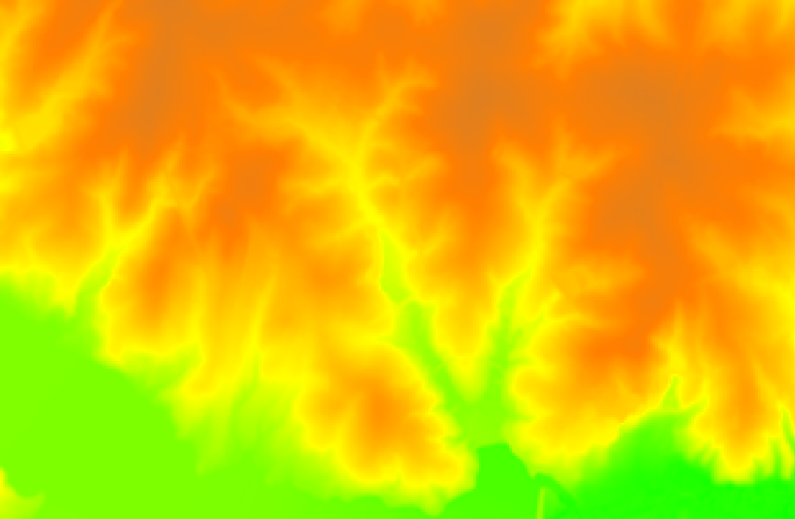
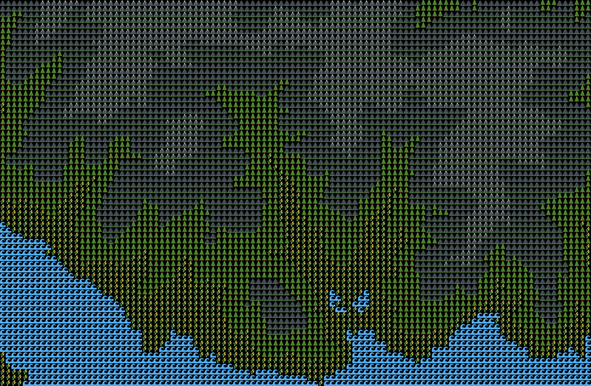
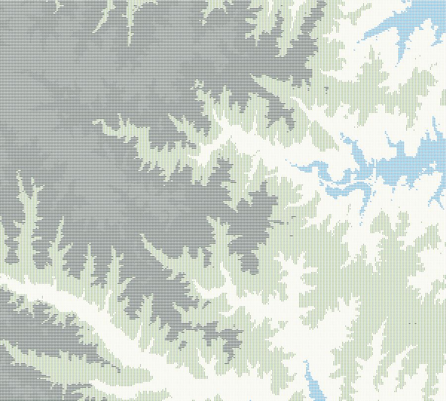
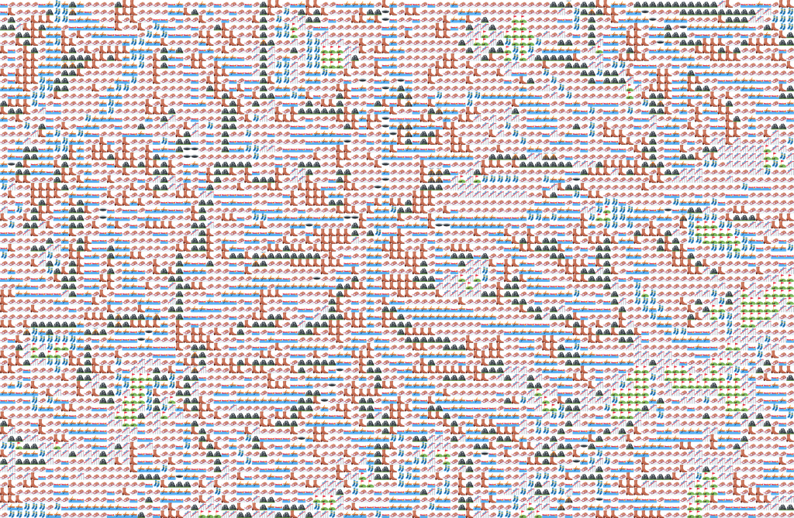
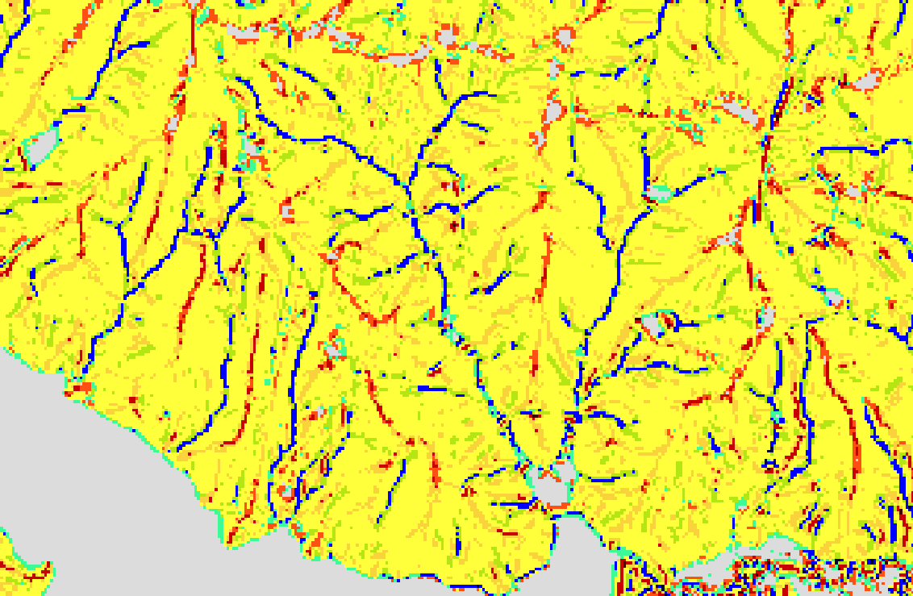
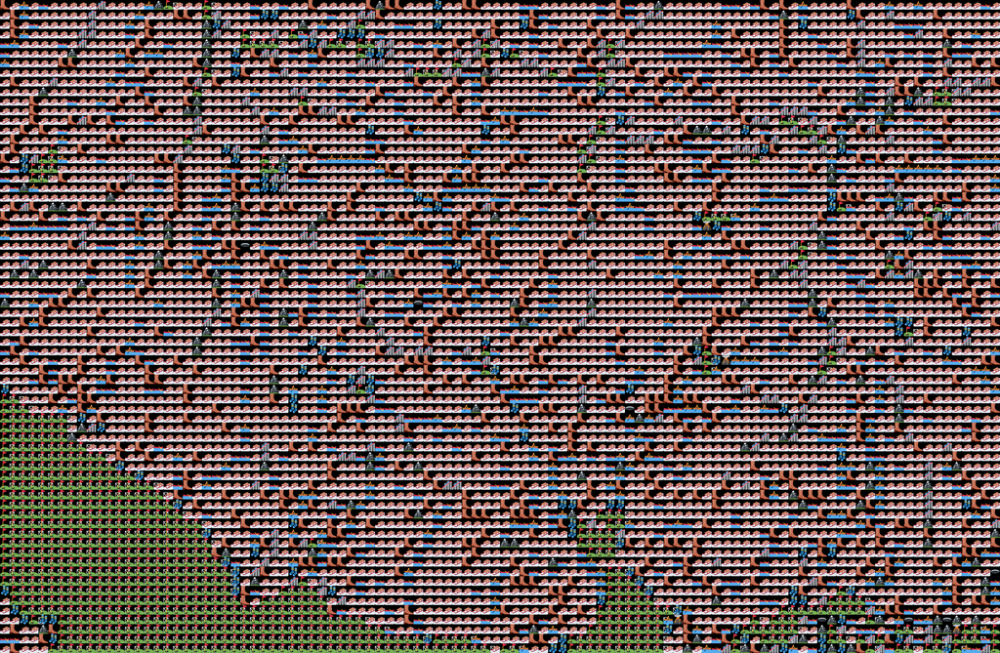

## emojis 😃

[twemoji](https://twemoji-cheatsheet.vercel.app/)

### Elevation

#### 🗺️ Elevation-Based Emoji Legend

This legend maps normalized elevation values to emojis using the `get_elevation_theme()` function:

| Normalized Elevation Range | Emoji | Description         |
|----------------------------|--------|---------------------|
| 0.00 – 0.20                | 🌊     | Water or lowland     |
| 0.20 – 0.40                | 🌾     | Agricultural plains  |
| 0.40 – 0.60                | 🌲     | Forested hills       |
| 0.60 – 0.80                | ⛰️     | Mountain slopes       |
| 0.80 – 1.00                | 🏔️     | Alpine peaks / highlands |

**Note:** Elevation values are first normalized to the 0–1 range using the min and max of the dataset.

:::{.row}
{width="49%"}
{width="49%"}
:::

### Landforms

#### Landform Emoji Legend

| ID | Landform  | Emoji |
|----|-----------|-------|
| 1  | Flat      | ⛳️    |
| 2  | Peak      | 🌋    |
| 3  | Ridge     | 🏔️    |
| 4  | Shoulder  | 🤷‍♀️    |
| 5  | Spur      | 👢    |
| 6  | Slope     | 📐    |
| 7  | Hollow    | 🛶    |
| 8  | Footslope | 🧦    |
| 9  | Valley    | 🚣    |
| 10 | Pit       | 🕳️    |

**Legend:** Emojis visually represent geomorphometric landform classes identified in the dataset.

{.full-screen}

:::{.row}
{width="49%"}
{width="49%"}
:::

### Landcover

#### NLCD Legend

| NLCD Class          | Emoji | Description             |
|---------------------|-------|-------------------------|
| Open Water          | 💧    | Lakes, rivers           |
| Developed, Open     | 🏡    | Lawns, suburbs          |
| Developed, Low      | 🏘️    | Small residential       |
| Developed, Medium   | 🏢    | Urban, moderate density |
| Developed, High     | 🌆    | Dense urban areas       |
| Barren Land         | 🪨    | Rock, sand              |
| Deciduous Forest    | 🍂    | Seasonal forests        |
| Evergreen Forest    | 🌲    | Conifer forests         |
| Mixed Forest        | 🌳    | Mixed canopy            |
| Shrub/Scrub         | 🌵    | Desert brush, scrub     |
| Grassland/Herbaceous| 🌾    | Open grasslands         |
| Pasture/Hay         | 🐄    | Ag fields, hay          |
| Cultivated Crops    | 🌽    | Cropland                |
| Woody Wetlands      | 🪵💧  | Forested wetland        |
| Emergent Wetlands   | 🌾💧  | Marshes, swamp grass    |

---

**Note:** These emojis are used for illustrative purposes in rendered image overlays or legends and may not be rendered in GRASS GUI.