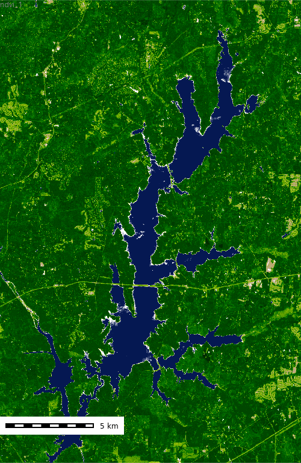

## Introduction

In this tutorial we will learn how to intergrate SpatioTemporal Asset Catalog (STAC) data into your GRASS workflow using the [t.stac](https://grass.osgeo.org/grass-stable/manuals/addons/t.stac.html) suite of tools for [GRASS](https://grass.osgeo.org).

* [t.stac.catalog](https://grass.osgeo.org/grass-stable/manuals/addons/t.stac.catalog.html) - is a tool for exploring SpatioTemporal Asset Catalogs metadata from a STAC API.
* [t.stac.collection](https://grass.osgeo.org/grass-stable/manuals/addons/t.stac.collection.html) - is a tool for exploring SpatioTemporal Asset Catalog (STAC) collection metadata.
* [t.stac.item](https://grass.osgeo.org/grass-stable/manuals/addons/t.stac.item.html) - is a tool for exploring and importing SpatioTemporal Asset Catalog item metadata and assets into GRASS.

STAC is an open specification that provides a common structure for describing and cataloging geospatial information. STAC organizes earth observation data into a hierarchy of **Catalogs** → **Collections** → **Items** → **Assets**, making large archives of cloud-hosted imagery discoverable and accessible through a standard API. Major providers such as AWS, Google Cloud, and Microsoft Planetary Computer publish their datasets as STAC-compliant APIs, giving you a unified way to search and retrieve data across platforms.

The `t.stac` addon suite bridges these STAC APIs with GRASSs' spatio-temporal data management framework. Instead of manually browsing catalogs and downloading files, `t.stac` lets you:

- **Search** by spatial extent and time window
- **Filter** by metadata properties such as cloud cover, sun elevation, and resolution
- **Import** matched assets directly into a GRASS project as a Space Time Raster Dataset (STRDS)

This tutorial walks through the full workflow: exploring a STAC catalog, querying Sentinel-2 imagery, downloading and importing it into GRASS, computing NDVI, and visualizing the time series.

The tutorial assumes you already have GRASS installed on your machine. If not please [download and install GRASS](https://grass.osgeo.org/download/) before continuing the tutorial.


## Getting Started

### Start GRASS Session

```{python}
# | label: config-grass

# Import standard python packages
import sys
import subprocess
from IPython.display import display, JSON, HTML
import json
import pandas as pd
from pathlib import Path
import seaborn as sns

# Ask GRASS where its Python packages are and add them to the path
sys.path.append(
    subprocess.check_output(["grass", "--config", "python_path"], text=True).strip()
)

# Import the GRASS python packages we need
import grass.script as gs
import grass.jupyter as gj

```

Create a GRASS project

```{python}
# | label: create-project
# | eval: false
gs.create_project("stac", epsg="32119", overwrite=True)
```

and start a GRASS session.

```{python}
# | label: start-grass-session
session = gj.init("stac")
```

### Install Addon

The [t.stac](https://grass.osgeo.org/grass-stable/manuals/addons/t.stac.html) addons require the following Python packages.

* [pystac (>=1.12)](https://pystac.readthedocs.io/en/latest/installation.html)
* [pystac_client (>=0.8)](https://pystac-client.readthedocs.io/en/stable/)
* [tqdm (>=4.67)](https://tqdm.github.io/)

You can install them using pip or the Python package manager of your choice. 

```bash
pip install pystac pystac_client tqdm
```

Now you can install the *t.stac* extensions.

```{python}
# | label: install-t-stac
# | eval: false
gs.run_command("g.extension", extension="t.stac")
```

### Define computational region

```{python}
# | label: grass-set-region
# | echo: true

gs.run_command(
    "g.region", n=236687, s=210391, e=616042, w=598921, nsres=10, ewres=10, flags="pa"
)
```

## STAC API

```{python}
# | label: set-stac-catalog-url

stac_url = "https://earth-search.aws.element84.com/v1/"
```

```{ojs}
//| label: ojs-helpers
//| echo: false

// renderValue is defined inside kvTable so OJS only sees one named cell,
// avoiding a circular reactive dependency between the two mutually recursive functions.
function kvTable(data) {
  function renderValue(v, key = "") {
    if (v === null)
      return htl.html`<span style="color:#999;font-style:italic">null</span>`;

    if (typeof v === "string") {
      const isImageUrl = /\.(jpg|jpeg|png|webp|gif)(\?.*)?$/i.test(v);
      const isCogUrl   = /\.tiff?(\?.*)?$/i.test(v);
      if (isImageUrl) {
        const img = htl.html``;
        img.onerror = () => img.style.display = "none";
        return htl.html`<div>${img}<a href="${v}" target="_blank"
          style="color:#1a73e8;font-size:11px;word-break:break-all">${v}</a></div>`;
      }
      if (isCogUrl)
        return htl.html`<div>
          <a href="${v}" target="_blank" style="color:#1a73e8;font-size:11px;word-break:break-all">${v}</a>
          ${cogMap(v)}
        </div>`;
      if (v.startsWith("http"))
        return htl.html`<a href="${v}" target="_blank"
          style="color:#1a73e8;word-break:break-all">${v}</a>`;
      return htl.html`<span style="color:#c41a16">${v}</span>`;
    }

    if (typeof v === "number")
      return htl.html`<span style="color:#1c00cf">${v}</span>`;

    if (typeof v === "boolean")
      return htl.html`<span style="color:#aa0d91">${String(v)}</span>`;

    if (Array.isArray(v)) {
      if (v.length === 0)
        return htl.html`<span style="color:#999">[ ]</span>`;
      if (v.every(i => typeof i !== "object") && v.length <= 8)
        return htl.html`<div style="display:flex;gap:4px;flex-wrap:wrap">
          ${v.map(i => htl.html`<span style="background:#e8f0fe;color:#1a73e8;
            font-size:11px;font-family:monospace;padding:2px 8px;border-radius:12px">${i}</span>`)}
        </div>`;
      return htl.html`<details>
        <summary style="cursor:pointer;color:#555;font-size:12px">[ ${v.length} items ]</summary>
        <ol style="margin:4px 0;padding-left:20px">
          ${v.map(i => htl.html`<li style="margin:2px 0">${renderValue(i)}</li>`)}
        </ol>
      </details>`;
    }

    if (typeof v === "object")
      return htl.html`<details>
        <summary style="cursor:pointer;color:#555;font-size:12px">{ ${Object.keys(v).length} keys }</summary>
        <div style="margin-top:4px">${kvTable(v)}</div>
      </details>`;

    return htl.html`<span>${String(v)}</span>`;
  }

  return htl.html`<table style="width:100%;border-collapse:collapse;font-size:13px">
    <thead>
      <tr>
        <th style="text-align:left;padding:8px 12px;background:#f5f5f5;color:#555;font-weight:600;width:35%">Property</th>
        <th style="text-align:left;padding:8px 12px;background:#f5f5f5;color:#555;font-weight:600">Value</th>
      </tr>
    </thead>
    <tbody>
      ${Object.entries(data).map(([k, v]) => htl.html`<tr style="border-bottom:1px solid #f0f0f0;vertical-align:top">
        <td style="padding:6px 12px;color:#881391;font-weight:600;font-family:monospace;font-size:12px">${k}</td>
        <td style="padding:6px 12px;font-family:monospace;font-size:12px">${renderValue(v, k)}</td>
      </tr>`)}
    </tbody>
  </table>`;
}
```

```{ojs}
//| label: ojs-cogmap
//| echo: false

// cogMap renders a COG directly in the browser using georaster-layer-for-leaflet,
// which uses HTTP range requests to fetch only the needed overview tiles —
// no external tile server required. Bounds are read from the COG metadata.
function cogMap(url) {
  if (!document.querySelector("#leaflet-css")) {
    const link = document.createElement("link");
    link.id = "leaflet-css";
    link.rel = "stylesheet";
    link.href = "https://cdn.jsdelivr.net/npm/leaflet@1.9.4/dist/leaflet.css";
    document.head.appendChild(link);
  }

  // Inject a script once and poll until the global is available
  function loadScript(src, globalName) {
    return new Promise((resolve, reject) => {
      if (window[globalName]) { resolve(); return; }
      if (document.querySelector(`script[data-cogmap="${globalName}"]`)) {
        const poll = setInterval(() => {
          if (window[globalName]) { clearInterval(poll); resolve(); }
        }, 50);
        return;
      }
      const s = document.createElement("script");
      s.setAttribute("data-cogmap", globalName);
      s.src = src;
      s.onload = resolve;
      s.onerror = () => reject(new Error(`Failed to load ${globalName}`));
      document.head.appendChild(s);
    });
  }

  const el = htl.html`<details style="margin-top:8px">
    <summary style="cursor:pointer;color:#1a73e8;font-size:12px;padding:4px 0">🗺 View on map</summary>
    <div style="position:relative;height:300px;margin-top:8px;border-radius:6px;overflow:hidden;border:1px solid #e0e0e0">
      <div class="map-status" style="position:absolute;inset:0;display:flex;align-items:center;
        justify-content:center;background:#f9f9f9;color:#666;font-size:12px;font-family:monospace;z-index:1000">
        Loading...
      </div>
    </div>
  </details>`;

  let initialized = false;
  el.addEventListener("toggle", async () => {
    if (!el.open || initialized) return;
    initialized = true;
    const wrap   = el.querySelector("details > div");
    const status = el.querySelector(".map-status");
    try {
      await loadScript(
        "https://cdn.jsdelivr.net/npm/leaflet@1.9.4/dist/leaflet-src.js", "L");
      await loadScript(
        "https://cdn.jsdelivr.net/npm/georaster@1.6.2/dist/georaster.min.js", "parseGeoraster");
      await loadScript(
        "https://cdn.jsdelivr.net/npm/georaster-layer-for-leaflet@2.0.2/dist/georaster-layer-for-leaflet.min.js", "GeoRasterLayer");

      const { L, parseGeoraster, GeoRasterLayer } = window;
      const map = L.map(wrap, { scrollWheelZoom: false });
      L.tileLayer("https://{s}.tile.openstreetmap.org/{z}/{x}/{y}.png", {
        attribution: "© OpenStreetMap contributors", maxZoom: 19
      }).addTo(map);

      status.textContent = "Fetching COG...";
      const georaster = await parseGeoraster(url);

      const layer = new GeoRasterLayer({
        georaster,
        opacity: 0.85,
        resolution: 128,
        pixelValuesToColorFn: values => {
          const v = values[0];
          if (!v || v === georaster.noDataValue) return null;
          const t = Math.min(1, v / 3000);   // scale to 0-3000 (S2 L2A reflectance)
          const c = Math.round(t * 255);
          return `rgb(${c},${c},${c})`;
        }
      });
      layer.addTo(map);
      map.fitBounds(layer.getBounds());  // bounds come directly from COG metadata
      map.invalidateSize();
      status.remove();
    } catch (e) {
      status.textContent = `${e.message || "Failed to load COG"}`;
      status.style.color = "#c00";
    }
  });

  return el;
}
```

### Searching STAC Catalogs

::: {.panel-tabset group="language"}

## Python

```{python}
# | label: tbl-stac-catalog
# | echo: true

catalogs_json = gs.parse_command(
    "t.stac.catalog", url=stac_url, format="json"
)

df_catalogs = pd.json_normalize(catalogs_json)
df_catalogs.head()

```

## Terminal
```{python}
# | label: tbl-stac-catalog-shell
# | echo: true

!t.stac.catalog url={stac_url} format=plain -b
```

:::

#### Collection Metadata

::: {.panel-tabset group="language"}

## Python
```{python}
# | label: tbl-stac-items
# | echo: true

items_json = gs.parse_command(
    "t.stac.item",
    url=stac_url,
    collection_id="sentinel-2-l2a",
    flags="m",
    format="json",
)

df_items = pd.json_normalize(items_json, max_level=0)
ojs_define(catalog_meta=df_items.drop(
    columns=["geometry", "links", "assets", "properties", "stac_extensions"],
    errors="ignore"
).to_dict(orient="records"))
```

## Terminal
```{python}
# | label: tbl-stac-items-m-shell
# | echo: true

!t.stac.item url={stac_url} collection_id="sentinel-2-l2a" format=plain -m
```

:::

```{ojs}
//| label: ojs-catalog-meta
//| echo: false
Inputs.table(catalog_meta, {width: "100%"})
```

#### Query Items by datetime and display table

::: {.panel-tabset group="language"}

## Python
```{python}
# | label: tbl-items
# | echo: true

items_json = gs.parse_command(
    "t.stac.item",
    url=stac_url,
    collection_id="sentinel-2-l2a",
    flags="i",
    datetime="2024-04-01/2024-09-30",
    format="json",
)
num_items = len(df_items)
df_items = pd.json_normalize(items_json, max_level=0)
ojs_define(items_table=df_items.drop(
    columns=["geometry", "links", "assets", "properties", "stac_extensions", "type"],
    errors="ignore"
).head(10).to_dict(orient="records"))
```

## Terminal
```{python}
# | label: tbl-stac-items-i-shell
# | echo: true

!t.stac.item url={stac_url} collection_id="sentinel-2-l2a" datetime="2024-04-01/2024-09-30" format=plain -i
```

:::

```{ojs}
//| label: ojs-items-table
//| echo: false
Inputs.table(items_table, {width: "100%"})
```

```{python}
# | label: count-items
# | echo: false

num_items = len(df_items)
# Can't use inline python with using Jupyter cache
print(f"There are {num_items} Sentinel 2 items found in our computational region.")
```


Let's look closer at the properties of item id `S2A_17SPV_20240919_0_L2A`.

```{python}
# | label: item-properties
# | echo: true

df_item = df_items.query("id == 'S2A_17SPV_20240919_0_L2A'")
df_properties = df_item["properties"].apply(pd.Series)
df_item_flat = pd.concat([df_item.drop("properties", axis=1), df_properties], axis=1)
ojs_define(item_props=df_item_flat.iloc[0].dropna().to_dict())

```

```{ojs}
//| label: ojs-item-props
//| echo: false
kvTable(item_props)
```

Let's look at the items properties
```{python}
# | label: item-properties-properties
# | echo: true

df_item = df_items.query("id == 'S2A_17SPV_20240919_0_L2A'")
df_properties = df_item["properties"].apply(pd.Series)
ojs_define(item_properties_kv=df_properties.iloc[0].dropna().to_dict())
```

```{ojs}
//| label: ojs-item-props-kv
//| echo: false
kvTable(item_properties_kv)
```

Now we let's look at the items assets.

```{python}
# | label: item-properties-assets
# | echo: true

df_item = df_items.query("id == 'S2A_17SPV_20240919_0_L2A'")
assets_dict = df_item["assets"].iloc[0]
ojs_define(item_assets=assets_dict)
```


```{ojs}
// | label: item-properties-assets-html
// | echo: false
function rolesBadge(roles) {
  if (!roles) return "";
  return htl.html`<div style="display:flex;gap:4px;flex-wrap:wrap">
    ${roles.map(r => htl.html`<span style="
      background:#e8f0fe;color:#1a73e8;
      font-size:11px;font-family:monospace;
      padding:2px 8px;border-radius:12px;
    ">${r}</span>`)}
  </div>`;
}

function assetPropCard([name, asset]) {
  return htl.html`<div style="
    background:white;
    border:1px solid #e0e0e0;
    border-radius:8px;
    padding:16px;
    display:flex;
    flex-direction:column;
    gap:8px;
    box-shadow:0 1px 3px rgba(0,0,0,0.1);
    min-width:250px;
    flex:1 1 250px;
  ">
    <div style="font-weight:700;font-size:14px;color:#333;border-bottom:2px solid #4a90d9;padding-bottom:6px">
      ${name}
    </div>
    ${asset.title ? htl.html`<div style="font-size:13px;color:#555">${asset.title}</div>` : ""}
    ${asset.type ? htl.html`<div style="font-size:12px;font-family:monospace;color:#888">${asset.type}</div>` : ""}
    ${rolesBadge(asset.roles)}
    ${asset.type?.includes("tiff") || /\.tiff?$/i.test(asset.href ?? "")
        ? cogMap(asset.href) : ""}
    ${asset.href ? htl.html`<a href="${asset.href}" target="_blank" style="
      font-size:11px;color:#1a73e8;
      white-space:nowrap;overflow:hidden;text-overflow:ellipsis;
    " title="${asset.href}">&#128279; View Asset</a>` : ""}
  </div>`;
}

htl.html`<div style="display:flex;flex-wrap:wrap;gap:16px;padding:8px">
  ${Object.entries(item_assets).map(assetPropCard)}
</div>`
```

#### Assets

Each STAC Item may contain multiple asset types (e.g. red, nir, thumbnail). The snippet below
enumerates assets across items, shows per-item asset rows, and prints simple summaries.

```{python}
# | label: asset-query
# | echo: true

stac_query = {"eo:cloud_cover": {"lt": 10}}
```


```{python}
# | label: tbl-items-assets
# | tbl-cap: Sentinel 2 Items Assets Metadata
# | echo: true

assets_json = gs.parse_command(
    "t.stac.item",
    url=stac_url,
    collection_id="sentinel-2-l2a",
    flags="ap",
    datetime="2024-04-01/2024-09-30",
    asset_keys="red,nir",
    query=json.dumps(stac_query),
    format="json",
)

ojs_define(assets_data=assets_json)
```

```{ojs}
// | label: item-assets-html
// | echo: false

function assetCard([name, asset]) {
  return htl.html`<div style="
    background:white;
    border:1px solid #e0e0e0;
    border-radius:8px;
    padding:16px;
    display:flex;
    flex-direction:column;
    gap:8px;
    box-shadow:0 1px 3px rgba(0,0,0,0.1);
    min-width:250px;
    flex:1 1 250px;
  ">
    <div style="font-weight:700;font-size:14px;color:#333;border-bottom:2px solid #4a90d9;padding-bottom:6px">
      ${asset.title ? htl.html`<div style="font-size:13px;color:#555">${asset.title}</div>` : ""}
    </div>
    ${rolesBadge(asset.roles)}
    ${asset.type ? htl.html`<div style="font-size:12px;font-family:monospace;color:#888">${asset.type}</div>` : ""}

    ${asset.roles?.includes("thumbnail") || asset.type?.startsWith("image/")
        ? htl.html`
            <span style="display:none;font-size:11px;color:#c00">Image blocked (CORS)</span>`
        : ""}
    ${asset.type?.includes("tiff") || /\.tiff?$/i.test(asset.href ?? "")
        ? cogMap(asset.href) : ""}
    ${asset.href ? htl.html`<a href="${asset.href}" target="_blank" style="
      font-size:11px;color:#1a73e8;
      white-space:nowrap;overflow:hidden;text-overflow:ellipsis;
    " title="${asset.href}">&#128279; View Asset</a>` : ""}
  </div>`;
}

htl.html`<div style="display:flex;flex-wrap:wrap;gap:16px;padding:8px">
  ${Object.entries(assets_data).map(assetCard)}
</div>`
```

```{python}
# | label: count-assets
# | echo: false

num_assets = len(assets_json)
# Can't use inline python with using Jupyter cache
print(f"There are {num_assets} Sentinel 2 assets found in our computational region.")
```

#### EO Parameters

STAC item properties expose a number of Earth Observation (EO) parameters that are useful for filtering and selecting scenes. Common properties you will see in Sentinel-2 and other EO STAC records include:

- `datetime` — acquisition time (ISO 8601)
- `eo:cloud_cover` — percent cloud cover (0–100)
- `eo:gsd` — ground sample distance / native resolution (meters)
- `view:sun_azimuth`, `view:sun_elevation` — sun geometry
- `proj:epsg` — EPSG code (when the projection extension is present)
- collection / platform / instrument fields — identify sensor and mission

How to use them:
- Use the `datetime` argument on t.stac.item to constrain time ranges (e.g. `2024-04-01/2024-09-30`).
- Use the `query` argument to pass a JSON object of property filters. Comparison operators follow the STAC filtering convention (e.g. `lt`, `lte`, `gt`, `gte`).

Example query:

```python
stac_query = {
    "eo:cloud_cover": {
        "lt": 10
    }, 
    "eo:gsd": {
        "lte": 10
    },
    "view:sun_elevation": {
        "gte": 30
    }
}
```

Pass this to t.stac.item (serialize with json.dumps) to fetch only low-cloud, high-sun-elevation, high-resolution items. Combine `asset_keys` to limit returned assets (e.g. `asset_keys="red,nir"`), and use flags (`-a`, `-m`, `-i`) to control output detail (assets, metadata, item list).

Tip: Always inspect a few returned items (`format="json"` or flags="m" / flags="a"`) to see the exact property names used by the catalog you query — naming can vary between providers and extension support.

### Create Metadata Vector

```{python}
# | label: assets-metadata-vector
# | tbl-cap: Sentinel 2 Items Assets Metadata
# | echo: true


stac_query = {"eo:cloud_cover": {"lt": 10}}

assets_json = gs.parse_command(
    "t.stac.item",
    url=stac_url,
    collection_id="sentinel-2-l2a",
    flags="a",
    datetime="2024-04-01/2024-09-30",
    asset_keys="red,nir",
    query=json.dumps(stac_query),
    items_vector="sentinel_2_items",
    format="json",
)


df_items_assets = pd.json_normalize(assets_json, max_level=0)
ojs_define(items_assets_table=df_items_assets.drop(
    columns=["geometry", "links", "assets", "properties", "stac_extensions", "type"],
    errors="ignore"
).head(10).to_dict(orient="records"))
```

```{ojs}
//| label: ojs-items-assets-table
//| echo: false
Inputs.table(items_assets_table, {width: "100%"})
```

#### View the items with iPyleaflet

View STAC items with ipyleaflet (install with `pip install ipyleaflet` if needed) from ipyleaflet use `gj.Interactive` and add the sentinel_2_items bounding boxes.

```{python}
# | label: view-items-map
# | echo: true

import random

m = gj.InteractiveMap()
m.add_vector(
    "sentinel_2_items",
    style={"opacity": 1, "dashArray": "9", "fillOpacity": 0.1, "weight": 1},
    hover_style={"color": "white", "dashArray": "0", "fillOpacity": 0.5},
    style_callback=lambda f: {
        "color": "black",
        "fillColor": random.choice(["red", "yellow", "green", "orange"]),
    }
)
m.map.center = (35.787137, -79.018917)
m.map.zoom = 8

display(m.show())

```

### Download and Import Rasters

With the STAC items identified and the STRDS structure defined, you can now download the raster assets directly into the GRASS project. The `t.stac.item` command with the `-d` (download) flag retrieves each Cloud Optimized GeoTIFF (COG), reprojects and resamples it to match the current computational region, and writes the resulting map names and timestamps to a text file for STRDS registration.

Control download behavior with:

- `nprocs` — number of parallel download workers
- `resolution` / `resolution_value` — output resolution strategy (`value` uses the number you specify in meters)
- `method` — resampling method (`nearest` is fastest; use `bilinear` or `cubic` for continuous data)
- `extent` — `region` clips each asset to the current computational region on import

### Register STRDS

::: {.panel-tabset}

## Python
```{python}
# | label: tbl-collection-items-assets
# | tbl-cap: Sentinel 2 Items Assets Metadata
# | echo: true

import grass.script as gs
import grass.jupyter as gj
stac_query = {"eo:cloud_cover": {"lt": 10}}

items_assets_json = gs.parse_command(
    "t.stac.item",
    url=stac_url,
    collection_id="sentinel-2-l2a",
    datetime="2024-04-01/2024-09-30",
    asset_keys="red,nir",
    format="json",
    query=json.dumps(stac_query)
)
```

## Terminal
```{python}
# | label: tbl-collection-items-assets-terminal
# | tbl-cap: Sentinel 2 Items Assets Metadata
# | echo: true

!t.stac.item url="https://earth-search.aws.element84.com/v1/" collection_id="sentinel-2-l2a" datetime="2024-04-01/2024-09-30" asset_keys="red,nir" format="json" query='{"eo:cloud_cover": {"lt": 10}}'
```

:::

```{python}
# | label: download-estimate
# | echo: true

print(f"""
Download Estimate
 
Files:  {items_assets_json["count"]}
Total Download Size: {items_assets_json["bytes"] / 1e9:.2f} GB
""")

```

```{python}
# | label: tbl-collection-items-assets-strds
# | tbl-cap: Sentinel 2 Items Assets Metadata
# | echo: true

stac_query = {"eo:cloud_cover": {"lt": 10}}

gs.run_command(
    "t.stac.item",
    url=stac_url,
    collection_id="sentinel-2-l2a",
    datetime="2024-04-01/2024-09-30",
    asset_keys="red,green,blue,nir",
    query=json.dumps(stac_query),
    strds_output="outputs/s2_rgbn.txt",
    format="json"
)
```

```{python}
# | echo: false
print(Path("outputs/s2_rgbn.txt").read_text())
```

```{python}
# | label: assets-metadata-strds-dates
# | echo: true

startdate = df_items_assets["datetime"].min()
enddate = df_items_assets["datetime"].max()
print(f"Start Date: {startdate}\nEnd Date: {enddate}")
```

Create a Space Time Raster Dataset (STRDS) to manage the Sentinel-2 data you want to analyze with GRASS. An STRDS is a container that links individual raster maps to their acquisition timestamps, enabling temporal queries, gap analysis, and time series computations with GRASS temporal tools (`t.rast.*`).

::: {.panel-tabset group="language"}

## Python

```{python}
# | label: create-strds
# | echo: true

# Create the space time dataset
gs.run_command(
    "t.create",
    output="sentinel_2",
    type="strds",
    temporaltype="absolute",
    title="Sentinel 2 Red/NIR Bands",
    description="Sentinel 2 Red/NIR Bands from 2024-04-01/2024-09-30",
    overwrite=True,
)
```

## Terminal

```bash
t.create \
  output=sentinel_2 \
  type=strds \
  temporaltype=absolute \
  title="Sentinel 2 Red/NIR Bands" \
  description="Sentinel 2 Red/NIR Bands from 2024-04-01/2024-09-30" \
  --overwrite
```

:::


Download the data

::: {.panel-tabset group="language"}

## Python

```{python}
# | label: download-assets
# | echo: true
# | eval: false

gs.run_command(
    "t.stac.item",
    url=stac_url,
    collection_id="sentinel-2-l2a",
    datetime="2024-04-01/2024-09-30",
    asset_keys="red,green,blue,nir",
    query=json.dumps(stac_query),
    strds_output="outputs/s2_rgbn.txt",
    format="json",
    method="nearest",
    resolution="value",
    resolution_value="10",
    extent="region",
    nprocs=16,
    flags="d",
)
```

## Terminal

```bash
t.stac.item \
  url="https://earth-search.aws.element84.com/v1/" \
  collection_id="sentinel-2-l2a" \
  datetime="2024-04-01/2024-09-30" \
  asset_keys="red,green,blue,nir" \
  query='{"eo:cloud_cover": {"lt": 10}}' \
  strds_output="outputs/s2_rgbn.txt" \
  format="json" \
  method="nearest" \
  resolution="value" \
  resolution_value="10" \
  extent="region" \
  nprocs=1 \
  -d
```

:::


Register the data

Once all assets are downloaded, register them into the STRDS using the text file produced by `t.stac.item`. Each line in the file contains a raster map name and its acquisition timestamp, which `t.register` uses to populate the temporal database.

::: {.panel-tabset group="language"}

## Python

```{python}
# | label: register-strds
# | echo: true

# Register the output maps into a space time dataset
gs.run_command(
    "t.register", input="sentinel_2", file="outputs/s2_rgbn.txt", type="raster"
)
```

## Terminal

```bash
t.register input=sentinel_2 file=outputs/s2_rgbn.txt type=raster
```

:::

```{python}
# | label: list-strds
# | echo: true

gs.run_command("t.info", type="strds", input="sentinel_2")
```

Now let's view a RGB composite of one of our tiles

```python
# Install the i.histo.match extension for histogram matching
gs.run_command("g.extension", extension="i.histo.match")
```

```{python}
# | label: display-composite
# | echo: true

s2_rgb_maps = [
    "sentinel-2-l2a.S2A_17SPV_20240909_0_L2A.red",
    "sentinel-2-l2a.S2A_17SPV_20240909_0_L2A.blue",
    "sentinel-2-l2a.S2A_17SPV_20240909_0_L2A.green",
]

s2_json = gs.parse_command(
    "r.univar",
    map=s2_rgb_maps,
    format="json",
)
print(f"Max value: {s2_json['max']}")

gs.run_command(
    "i.histo.match",
    input=s2_rgb_maps,
    suffix="255",
    max=s2_json["max"],
    output="sentinel-2-l2a.S2A_17SPV_20240909_0_L2A",
)
gs.run_command(
    "r.colors",
    map=[
        "sentinel-2-l2a.S2A_17SPV_20240909_0_L2A.red.255",
        "sentinel-2-l2a.S2A_17SPV_20240909_0_L2A.blue.255",
        "sentinel-2-l2a.S2A_17SPV_20240909_0_L2A.green.255",
    ],
    color="grey",
)

gs.run_command(
    "i.colors.enhance",
    r="sentinel-2-l2a.S2A_17SPV_20240909_0_L2A.red.255",
    b="sentinel-2-l2a.S2A_17SPV_20240909_0_L2A.blue.255",
    g="sentinel-2-l2a.S2A_17SPV_20240909_0_L2A.green.255",
)

m = gj.Map(use_region=True, filename="images/sentinel2_rgb.png")
m.d_rgb(
    red="sentinel-2-l2a.S2A_17SPV_20240909_0_L2A.red.255",
    blue="sentinel-2-l2a.S2A_17SPV_20240909_0_L2A.blue.255",
    green="sentinel-2-l2a.S2A_17SPV_20240909_0_L2A.green.255",
)
m.d_barscale()
m.show()
```

#### Temporal Map Calculations

Run a temporal map calculation on your entire STRDS to generate an NDVI layer.

```{python}
# | label: temporal-mapcalc
# | echo: true

gs.run_command(
    "t.rast.mapcalc",
    inputs=["sentinel_2.nir", "sentinel_2.red"],
    output="ndvi",
    basename="ndvi",
    method="follows",
    expression=(
        "float(if('sentinel_2.nir' >= 10000, 10000, 'sentinel_2.nir') - if('sentinel_2.red' >= 10000, 10000, 'sentinel_2.red')) / (if('sentinel_2.nir' >= 10000, 10000, 'sentinel_2.nir') + if('sentinel_2.red' >= 10000, 10000, 'sentinel_2.red'))"
    ),
    overwrite=True,
    flags="n",
)
```

Check to see it worked.

```{python}
# | label: list-strds-ndvi
# | echo: true

gs.run_command("t.list", type="strds")
```

and plot the NDVI

```{python}
# | label: plot-ndvi
# | echo: true
strds_df = pd.DataFrame(
    gs.parse_command(
        "t.rast.list",
        input="ndvi",
        order="start_time",
        columns=["name", "semantic_label", "start_time", "end_time", "min", "max"],
        format="csv",
    )
)

# Convert start_time to datetime for better formatting
strds_df["start_time"] = pd.to_datetime(strds_df["start_time"])

sns.lineplot(
    x="start_time", y="max", data=strds_df
)

# Format x-axis labels for better readability
import matplotlib.dates as mdates
import matplotlib.pyplot as plt

plt.gca().xaxis.set_major_formatter(mdates.DateFormatter('%Y-%m-%d'))
plt.gcf().autofmt_xdate()  # Auto-rotate date labels
plt.show()
```

```{python}
# | label: display-ndvi-maps-individual
# | echo: true
# | layout-ncol: 3
ndvi_list = gs.parse_command(
    "t.rast.list",
    input="ndvi",
    order="start_time",
    columns=["name", "semantic_label", "start_time", "end_time", "min", "max"],
    format="csv",
)
gs.run_command("t.rast.colors", input="ndvi", color="ndvi")

for ndvi in ndvi_list:
    map_name = ndvi.get("name")
    m = gj.Map(use_region=True, width=500)
    m.d_rast(map=map_name)
    m.d_barscale()
    m.d_legend(raster=map_name, flags="b")
    m.show()
```

Use the series map to view the entire time series of NDVI maps in one interactive map or save as a GIF.

```{python}
# | label: display-time-series
# | echo: true

ndvi_rasters = [
    i.get("name")
    for i in gs.parse_command(
        "t.rast.list",
        input="ndvi",
        order="start_time",
        columns=["name"],
        format="csv",
    )
]

# Create Time Series Map
m = gj.SeriesMap(use_region=True, width=500)
m.add_rasters(rasters=ndvi_rasters)
m.d_barscale()
m.render()
m.save("outputs/ndvi_time_series.gif")
```



## References

- [pystac Documentation](https://pystac.readthedocs.io/)
- [pystac_client Documentation](https://pystac-client.readthedocs.io/)