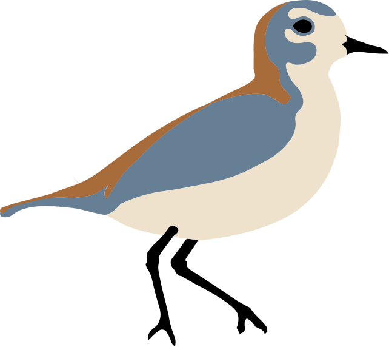
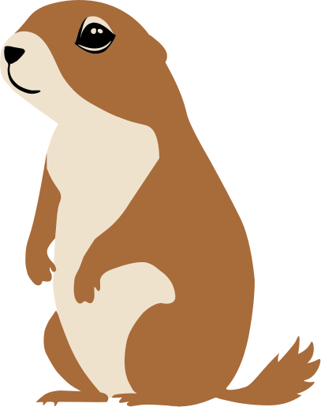

```{=html}
<style>#title-block-header { display: none; } #quarto-document-content { padding-top: 0 !important; margin-top: 0 !important; }</style>
<section class="op-hero op-sky-day" id="op-hero">
  <div class="op-stars" aria-hidden="true"></div>
  <div class="op-hero-inner">
    <div class="op-hero-copy">
      <div class="op-eyebrow">Tutorials, workshops, and talks</div>
      <h1><span class="op-light">Learn to build</span><br><span class="op-bold">geospatial models</span><br><span class="op-light">with </span><span class="op-bold">GRASS</span><span class="op-light"> in the cloud.</span></h1>
      <p class="op-hero-lede">Hands-on notebooks that start in a local <a href="https://grass.osgeo.org">GRASS</a> project and end in a browser or on a cloud API. Terrain, hydrology, satellite imagery, and simulation, using the tools <a href="https://openplains.com">OpenPlains</a> builds.</p>
      <div class="op-hero-actions">
        <a class="op-btn op-btn-primary" href="content/notebooks/index.qmd">Start with a tutorial</a>
        <a class="op-btn op-btn-outline" href="content/workshops/index.qmd">Browse workshops</a>
      </div>
    </div>
    <div class="op-hero-art" aria-hidden="true">
      <div class="op-sun"></div>
      
      
    </div>
  </div>
</section>

<nav class="op-paths" aria-label="Content types">
  <a class="op-path" href="content/notebooks/index.qmd">
    <svg viewBox="0 0 24 24" fill="none" stroke-width="2" stroke-linecap="round" stroke-linejoin="round" aria-hidden="true"><path d="M4 19.5A2.5 2.5 0 0 1 6.5 17H20"></path><path d="M6.5 2H20v20H6.5A2.5 2.5 0 0 1 4 19.5v-15A2.5 2.5 0 0 1 6.5 2z"></path></svg>
    <span class="op-path-title">Tutorials</span>
    <span class="op-path-text">Self-paced notebooks you can run locally or open in Colab. Each one ends with a workflow you can reuse.</span>
    <span class="op-path-link">Browse tutorials</span>
  </a>
  <a class="op-path" href="content/workshops/index.qmd">
    <svg viewBox="0 0 24 24" fill="none" stroke-width="2" stroke-linecap="round" stroke-linejoin="round" aria-hidden="true"><path d="M17 21v-2a4 4 0 0 0-4-4H5a4 4 0 0 0-4 4v2"></path><circle cx="9" cy="7" r="4"></circle><path d="M23 21v-2a4 4 0 0 0-3-3.87"></path><path d="M16 3.13a4 4 0 0 1 0 7.75"></path></svg>
    <span class="op-path-title">Workshops</span>
    <span class="op-path-text">Half-day and full-day material from FOSS4G NA and classroom events, with setup instructions and data.</span>
    <span class="op-path-link">Browse workshops</span>
  </a>
  <a class="op-path" href="content/presentations/index.qmd">
    <svg viewBox="0 0 24 24" fill="none" stroke-width="2" stroke-linecap="round" stroke-linejoin="round" aria-hidden="true"><rect x="2" y="3" width="20" height="14" rx="2"></rect><path d="M8 21h8"></path><path d="M12 17v4"></path></svg>
    <span class="op-path-title">Talks</span>
    <span class="op-path-text">Slides from conference sessions on OpenPlains and case studies in cloud GRASS.</span>
    <span class="op-path-link">Browse talks</span>
  </a>
</nav>

<div class="op-section-head">
  <div>
    <div class="op-eyebrow">Latest</div>
    <h2>Recently published</h2>
  </div>
  <a class="op-view-all" href="content/blog/index.qmd">All posts</a>
</div>
<script>
  (function () {
    // Tint the hero sky by the visitor's local time. ?sky=dawn|day|dusk|night overrides it.
    var hero = document.getElementById("op-hero");
    if (!hero) return;
    var forced = new URLSearchParams(window.location.search).get("sky");
    var h = new Date().getHours();
    var sky = forced || (h >= 5 && h < 8 ? "dawn" : h >= 8 && h < 17 ? "day" : h >= 17 && h < 20 ? "dusk" : "night");
    hero.classList.remove("op-sky-day");
    hero.classList.add("op-sky-" + sky);
  })();
</script>
```

:::{#recent}
:::
